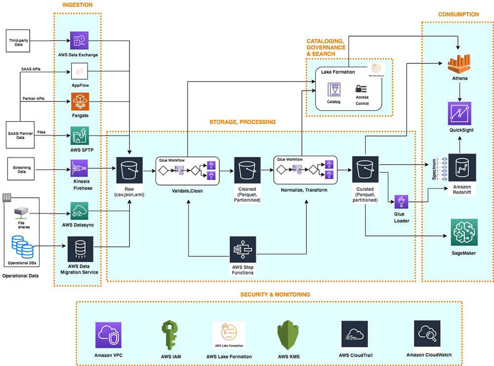

# Project Anthill :ant:

## Introduction

This is a self-developed project by me (@jtorsvik :monkey_face:) for building a Analytics Platform in AWS with the IaC-tool Terraform :heavy_multiplication_x:.

The name Anthill reflects the project's core philosophy: like an anthill, this platform is designed to be highly organized, resilient, and efficient, with each component working autonomously yet harmoniously to support the whole system.

This project aims to:

:mountain_cableway: Automate infrastructure provisioning using Terraform.\
:cloud: Leverage AWS services for data ingestion, storage, processing, and visualization.\
:bar_chart: Enable scalable and maintainable analytics workflows.\
:repeat: Promote modularity, reusability, and CI/CD best practices.

Whether you're exploring cloud analytics, learning Terraform, or building your own data platform, this project is a hands-on example of how to bring it all together.

The project will also explore the implementation of CI/CD pipelines with GitHub Actions :sparkler: and Python Package management with UV :crown:.

## AWS Data Platform

The AWS Data Platform Data architecture and platform development is built on the Data Lake architecture on Databricks.

**1. Ingestion**\
This layer is responsible for collecting data from a wide variety of sources—such as APIs, databases, streaming services, and file transfers—and bringing it into the platform. It ensures that data from both real-time and batch sources is reliably and securely ingested for further processing.

**2. Storage**\
Once ingested, data is stored in a raw format (bronze layer) to preserve its original structure. This environment also includes a curated zone (silver layer) where data is cleaned, transformed, and optimized for analysis. The separation between raw and curated storage supports data lineage, reproducibility, and compliance.
All aggregated data (gold layer) will be stored within SQL tables in Databricks, as will all other data that will be applied in Power BI.

**3. Data Governance**\
This layer ensures that data is discoverable, secure, and used responsibly. It includes cataloging, access control, and data lineage tracking. Governance mechanisms help enforce compliance, manage metadata, and provide transparency into how data is used across the platform.

**4. Development & Consumption**\
This is the core of the platform for data engineers and data scientists. It enables data transformation, feature engineering, and machine learning model development. Tools in this layer support both automated workflows and interactive development environments.

**5. Security, Networks & Monitoring**\
This foundational layer spans the entire platform, providing identity management, encryption, network isolation, and activity monitoring. It ensures that data is protected at all stages—ingestion, storage, processing, and consumption—while also enabling auditing and operational visibility.
